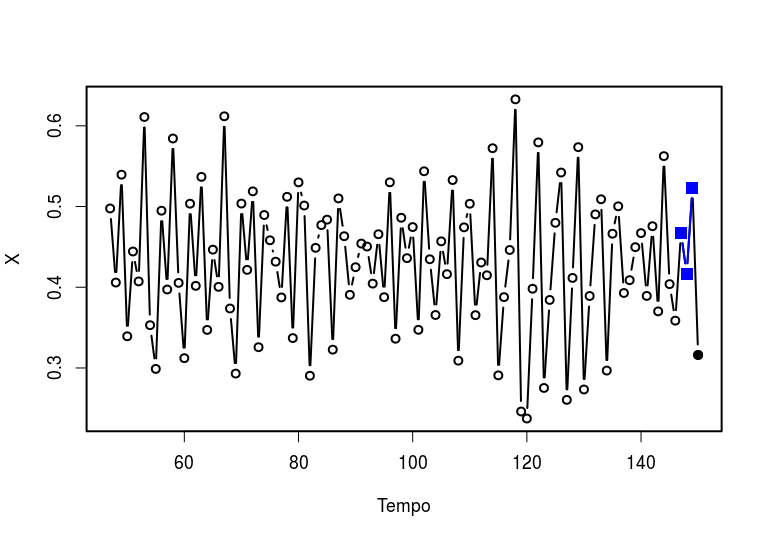
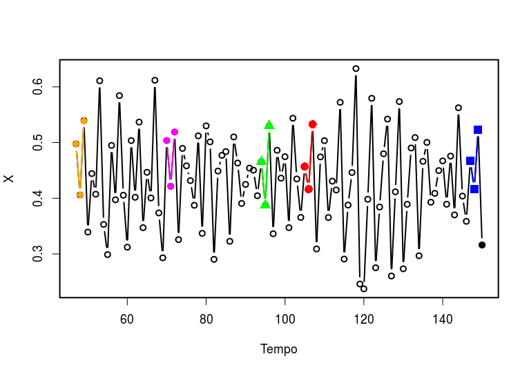
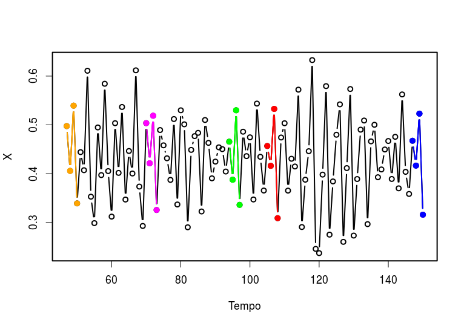
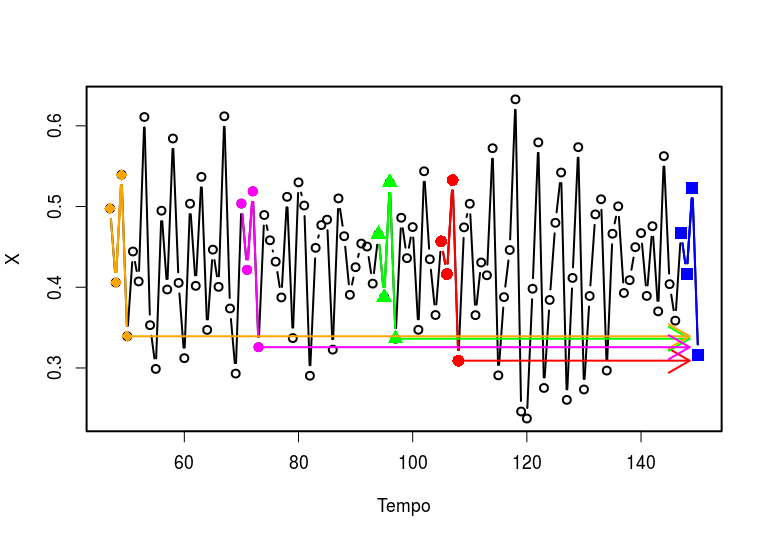
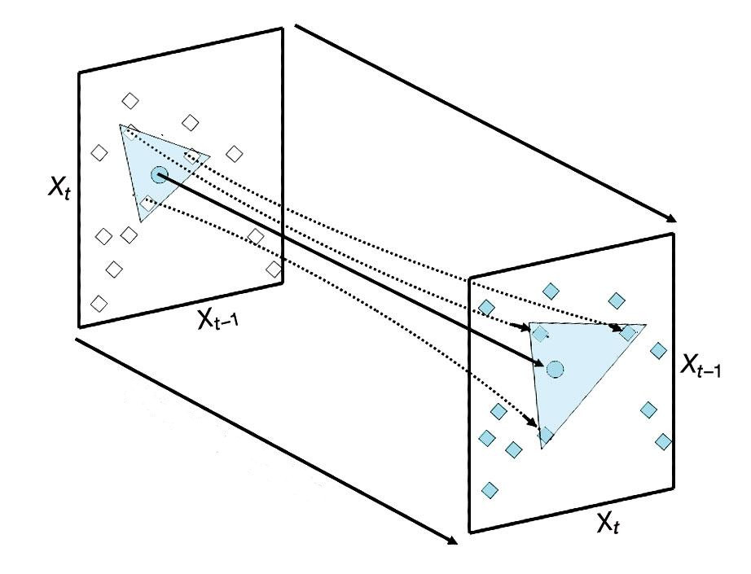

layout: true

```{r xaringan-themer, include = FALSE}
options(htmltools.dir.version = FALSE)
library(xaringanthemer)
library(xaringanExtra)
library(knitr)
duo_accent(
  primary_color = "#A70000",
  secondary_color = "#ff0000",
  white_color = "white",
  
  header_font_google = google_font("Roboto Condensed"),
  text_font_google   = google_font("Roboto Condensed", "300", "300i"),
  code_font_google   = google_font("Ubuntu Mono"), text_font_size = "30px")
```
background-image:url("logo-IFT.png")
background-position: 5% 100%
background-size: 10%

---
class: left

## Find me at

.left-column[

##### email: rafael.lp.silva@unesp.br
##### Twitter: [@rafalpx](twitter.com/rafalpx)
##### github: [rafalopespx](github.io/rafalopespx)
]
.pull-right[
  
]
---
## Recapitulando

* Qualquer série temporal pode ser escrita na forma $X_n=F^n(X_0)$

* Qualquer sistema dinâmico tem um **espaço-de-fase**

* O **Teorema de Takens** permitir reconstruir espaços-de-fase a partir de uma única série e seus **atrasos**

* Duas **variedades-sombras** que se mapeiam mutuamente, pertencem ao mesmo sistema dinâmico

---
## Questões

--

* Como determinar o tanto de **atrasos** necessários a reconstrução?

* Como determinar se duas variedades se **mapeiam**?
--
.center[
  Projeção **Simplex** (Hoje)

  CCM ou **Convergent Cross Mapping** (Amanhã)
  ]
---
## Projeção Simplex

--
Uma forma de dar uma previsão de curto prazo para uma série temporal é a através de uma projeção simplex, dada uma série temporal:
--
```{r echo=FALSE, out.width="75%", fig.align='center', fig.keep='first'}

```
---
## Projeção Simplex

--
Procuramos o mesmo padrão de logo antes do fim da séries em outros momentos da série, com isso temos:
```{r echo=FALSE, out.width="75%", fig.align='center', fig.keep='first'}

```
---
## Projeção Simplex

--
Com esses padrões olhamos os pontos seguintes, eles nos darão uma ideia do que acontece após esse padrão:
```{r echo=FALSE, out.width="75%", fig.align='center', fig.keep='first'}

```
---
## Projeção Simplex

--
Com esses padrões olhamos os pontos seguintes, eles nos darão uma ideia do que acontece após esse padrão:
```{r echo=FALSE, out.width="75%", fig.align='center', fig.keep='first'}

```
---
## Projeção Simplex

--
Através de uma média ponderada desses padrões podemos estimar o próximo ponto da série, numa fórmula:
$$
\hat{X}(t+h) = \sum^{E+1}_{i=1}w_iX_i(t+h)
$$
--

Ou seja nossa estimativa $\hat{X}$ será uma média ponderada dos pontos $X_i$ imediatamente após o padrão
---
## Projeção Simplex

--
Outra forma de visualizar a projeção **Simplex** é através da seguinte ideia, no espaço-de-fase:
```{r echo=FALSE, out.width="75%", fig.align='center', fig.keep='first'}

```
---
## Seleção de *Embedding*

--
Para selecionar a dimensão adequada ao **Embedding** contabilizamos a correlação entre o predito e o observado, numa fórmula

$$
\begin{equation*}
  \rho = \rho_{X,\hat{X}} = \frac{\mathrm{cov}(X(t),\hat{X})}{\sigma_{X}\sigma_{\hat{X}}} \label{rhosimplex}
\end{equation*}
$$
Onde $\rho$ é um valor entre 0 e 1, $\mathrm{cov}$ é a covariância e $\sigma$s são os desvios padrão
---
## Seleção de *Embedding*

Geramos duas séries simples, como abaixo:
```{r echo=TRUE}
## Two vectors to store data
X <- c()
Y <- c()
## Initial values
X[1] <- 0.1
Y[1] <- 0.3
X[2] <- 0.3
Y[2] <- 3.78*Y[1] - 3.78*Y[1]^2
## Iterate the dynamics 150 time steps
for(i in 3:150){
    X[i] <- 3.77*X[i-1] - 3.77*X[i-1]^2 - 0.85*Y[i-1]*X[i-1] - 0.5*X[i-2] #<<
    Y[i] <- 3.78*Y[i-1] - 3.78*Y[i-1]^2 #<<
}
```
---
## Seleção de *Embedding*

--
plotando a série:
```{r echo=TRUE, out.width="50%"}
plot(X, xlab="Time", ylab="X", type="l", lty=3)
```
---
## Seleção de *Embedding*

Testamos o $\rho$ para diferentes dimensões de **embedding**:
```{r echo=TRUE}
library(rEDM)
find.emb <- simplex(time_series = X, E = 1:10) #<<
head(find.emb)
```
---
## Seleção de *Embedding*
.pull-left[
```{r echo=TRUE, eval=FALSE}
plot(as.numeric(rho) ~ E, 
     data=find.emb, 
     type="b",
     xlab = "Embedding dimensions",
     ylab = expression(paste("Forecast skill (",rho,")",sep="")))
points(y = find.emb$rho[which.max(find.emb$rho)],
       x = find.emb$E[which.max(find.emb$rho)], 
       col = "red", 
       pch = 19, 
       size = 3)
```
]

.pull-right[
```{r echo=FALSE, eval=TRUE}
plot(as.numeric(rho) ~ E, data=find.emb, type="b",
     xlab = "Embedding dimensions",
     ylab = expression(paste("Forecast skill (",rho,")",sep="")))
points(y = find.emb$rho[which.max(find.emb$rho)],
       x = find.emb$E[which.max(find.emb$rho)], col = "red", pch = 19, size = 3)
```
]
---
## Predições

--
Agora com a dimensão ótima de **embedding** vamos realizar predições:
```{r echo=TRUE}
predE3 <- simplex(time_series = X, E = 3, stats_only = FALSE) #<<
names(predE3)
```
--

```{r echo=TRUE}
fits <- predE3$model_output[[1]]
head(fits)
```
---

## Predições

Plotando a predição
.pull-left[
```{r, eval=FALSE, echo=TRUE}
plot(Predictions ~ Index, 
     data = fits, type = "l", 
     col = "blue", lwd=3,
     xlab="Time", ylab="X")
lines(Observations ~ Index, 
      data = fits, 
      col=grey.colors(1, alpha=0.25), 
      lwd = 6)
legend("topright", 
       c("Observed", "Predicted"), 
       lty=1, lwd=c(6,3),
       col=c(grey.colors(1, alpha=0.25), 
             "blue"),bty="n")
```
]

.pull-right[
```{r, eval=TRUE, echo=FALSE, fig.keep='high'}
plot(Predictions ~ Index, data = fits, type = "l", col = "blue", lwd=3,
     xlab="Time", ylab="X")
lines(Observations ~ Index, data = fits, col=grey.colors(1, alpha=0.25), lwd = 6)
legend("topright", c("Observed", "Predicted"), lty=1, lwd=c(6,3),
       col=c(grey.colors(1, alpha=0.25), "blue"),bty="n")
```
]
---
## Recapitulando

* Com a a projeção **Simplex** podemos determinar a dimensão de **embedding** para reconstruir a dinâmica

* A dimensão será o máximo da correlação entre o predito e o observado, a predição será feita com uma projeçaõ **Simplex**

* Com isso já podemos dar boas predições para o sistema


---
# Obrigado!

## Referências:

* Materiais e slides: [rafalopespx.github.io/WorkshopEDM/](http://rafalopespx.github.io/WorkshopEDM/)

<!-- * Vídeos do [YouTube](http://www.youtube.com/watch?v=fevurdpiRYg&list=PL-SSmlAMhY3bnogGTe2tf7hpWpl508pZZ) sobre o Teorema de Takens. -->

* Canal do [Slack](https://app.slack.com/client/T01BJETR8S3/C01CXH8H9KM) para discussão, dúvidas, etc.

* Tutorial Hands-on Takens Theorem [Extra](https://rafalopespx.github.io/WorkshopEDM/Hands-on_Takens.html)

* Tutorial Simplex projection made it simple [Extra](https://rafalopespx.github.io/WorkshopEDM/simplex.html)