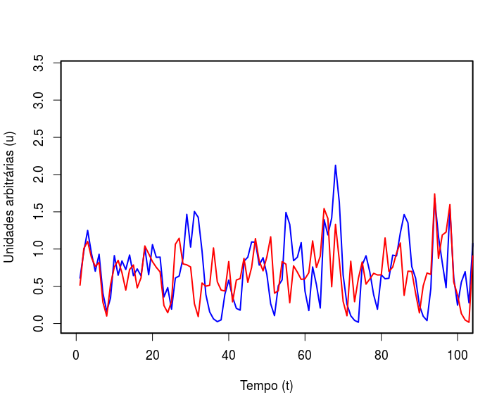
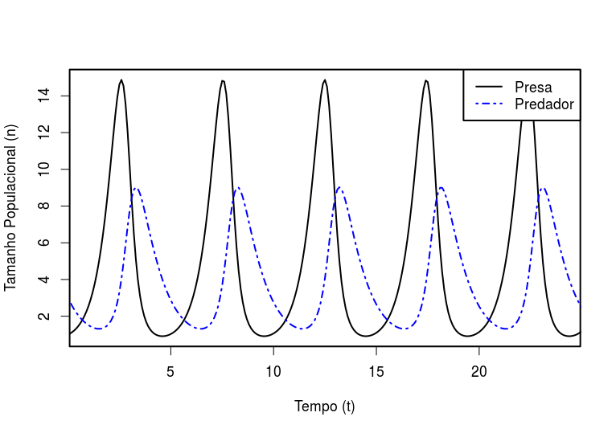
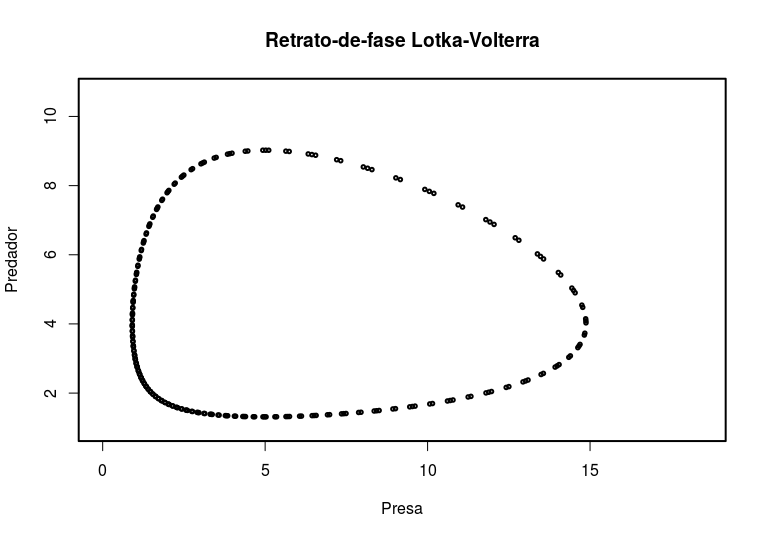
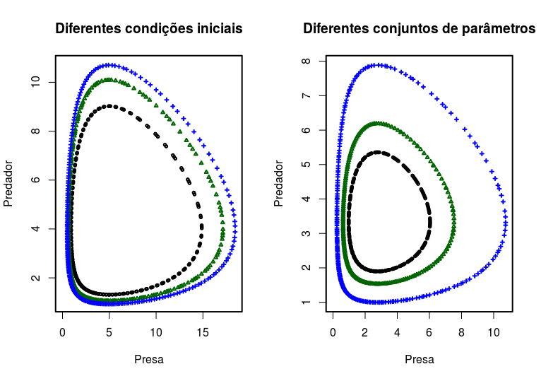
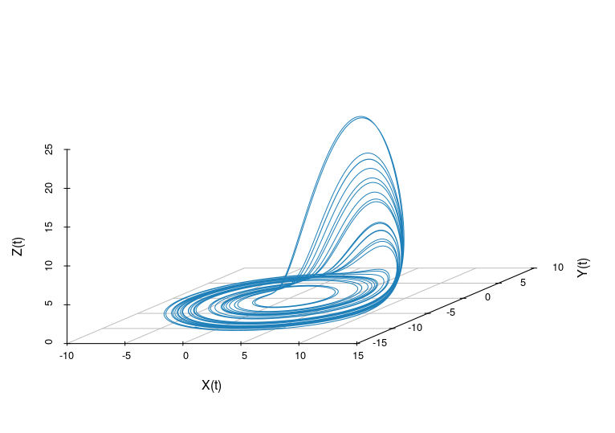
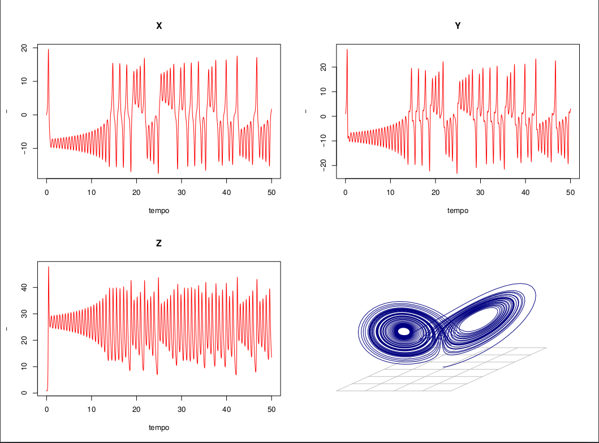

layout: true

```{r xaringan-themer, include = FALSE}
options(htmltools.dir.version = FALSE)
library(xaringanthemer)
library(xaringanExtra)
library(knitr)
library(ggplot2)
duo_accent(
  primary_color = "#A70000",
  secondary_color = "#ff0000",
  white_color = "white",
  
  header_font_google = google_font("Roboto Condensed"),
  text_font_google   = google_font("Roboto Condensed", "300", "300i"),
  code_font_google   = google_font("Ubuntu Mono"), text_font_size = "30px")
```
background-image:url("logo-IFT.png")
background-position: 0% 100%
background-size: 10%

---
class: left

## Find me at

.left-column[

##### email: rafael.lp.silva@unesp.br
##### Twitter: [@rafalpx](twitter.com/rafalpx)
##### github: [rafalopespx](github.io/rafalopespx)
]
.pull-right[
  
]
---
class: left

## Motivação

Como determinar se duas séries temporais se relacionam?
--
```{r plot1, echo=FALSE, out.height=475, out.width=600, fig.align='center'}

```

---

## Sistemas Dinâmicos

--
Podemos sempre pensar qualquer série temporal como resultado de um regra do tipo:
$$X_1 = F(X_0)$$
--
Onde $X_1$ é uma função de seu passo anterior
---

## Sistemas Dinâmicos

--
Se continuamos com essa regra temos $$X_2=F(X_1)=F(F(X_0))=F^2(X_0)$$ e assim por diante, de forma geral:
$$X_n=F^n(X_0)$$
---
## Dinâmica de Populações

--
Um primeiro modelo matemático que incorpora essa ideia é o modelo de *Lotka-Volterra*:

$$
\begin{equation}
\dot{x} = (b-py)x \\
\dot{y} = (rx-d)y \label{lotka-volterra}
\end{equation}
$$
Primeiro modelo a descrever o ciclo de presas e predadores
Sabemos que aqui a causa é clara, $x$ é predado por $y$
---
## Dinâmica de Populações

Quando integramos essas equações encontremos o seguinte:
--
```{r echo=FALSE, out.height=475, out.width=600, fig.align='center'}

```
---
## Dinâmica de Populações

Uma outra forma de olhar essa dinâmica é através de um espaço-de-fase:
--
```{r echo=FALSE, out.height=475, out.width=600, fig.align='center'}

```
---
## Dinâmica de Populações

Conforme alteramos os parâmetros e as condições iniciais de podemos encontrar diferentes **trajetórias**
--
```{r echo=FALSE, out.height=475, out.width=600, fig.align='center'}

```
---
## Atratores

Qualquer conjunto **trajetórias** no espaço-de-fase para um longo período de tempo, chamaremos de **atratores**
--
```{r echo=FALSE, out.height=475, out.width=600, fig.align='center'}

```
---

## Recapitulando

* Qualquer série temporal pode ser entendida como uma regra de sucessão do tipo $X_n = F^n(X_0)$

* para um sistema *n*-dimensional podemos visualizar sua dinâmica num **espaço-de-fase**, em que as variáveis desse sistema são plotadas uma em função da outra

* Sistemas dinâmicos podem apresentar **atratores**, conjuntos de **trajetórias** para longos períodos de tempo

---

## Reconstrução de Atratores

O sistema de *Lorentz* é um sistema que apresenta um atrator, ele é resultado da resolução das equações:
--
$$
\begin{equation*}
  \dot{X} = \sigma(Y-X)\\
  \dot{Y} = rX-Y-XZ \\
  \dot{Z} = XY-bZ
  \label{eq:Lorenz}
\end{equation*}
$$
---

## Reconstrução de Atratores

Cada equação expressa uma série temporal para o sistema, então temos:
--

```{r echo=FALSE, out.height=475, out.width=600, fig.align='center'}

```
---
## Reconstrução de Atratores

* Porém nem sempre conhecemos todas as **variáveis** de um sistema completamente

* A questão que fica é mas e quando não temos todas as variáveis ou **séries temporais** que compõe o sistema, como podemos entender a **dinâmica**?

* A resposta é sim, através do **teorema de Takens** 
---
## Teorema de Takens

Considere uma variedade $M$ de dimensão $m$ e $2m+1$ funções observação do tipo, $x_k:M\rightarrow\mathbb{R}$, sendo elas, uma série temporal do sistema e as outras seus 2m atrasos, então:

$$\Phi = (x(t), x(t-\tau), ..., x(t-2m\tau))$$
é uma **embedding**.

--

Ou seja, $\Phi$ é uma representação válida de $M$ num espaço euclidiano de $E=2m+1$ dimensões, e que conserva todas suas características topológicas bem como a sua **dinâmica**. $E$ é a dimensão de **embedding**.
---
## Teorema de Takens

--

* De forma simples, qualquer sistema dinâmico pode ser reconstruído, basta que se tenha uma **série temporal** desse sistema e faça-se tantos atrasos quanto sejam necessários. 

--

* Para **mergulhar** essa dinâmica num espaço euclidiano, que de deve ter $2m+1$ dimensões, onde $m$ é a dimensão original do espaço que será reconstruindo.

---
## Reconstrução na prática

--
Se só tivermos a série do $X$ no sistema de *Lorentz*, com o **teorema de Takens** podemos reconstruir o sistema todo, e sua **dinâmica**
--

```{r echo=FALSE, out.height=400, out.width=600, fig.align='center'}
lorentz_X<- read.csv("problem-time-series.csv")
ggplot(data = lorentz_X, aes(x=time, y=X))+
  geom_line()+
  theme_bw()+
  labs(x = "Tempo",
       y = "X")
```
---
## Reconstrução na prática

--
Data frame de duas colunas:
```{r echo=TRUE}
knitr::kable(
  head(lorentz_X), #<<
  format = 'html')
```
---
## Reconstrução na prática

--
Código para fazer atrasos:
```{r echo=TRUE}
source("https://raw.githubusercontent.com/mathbio/edmTutorials/master/utilities/make_block.R") #<<
X_lag<-make_block(block = data.frame(lorentz_X$X), max_lag = 3) #<<
knitr::kable(
  head(X_lag, 5), #<<
  format = 'html')
```
---
## Reconstrução na prática
Reconstrução do **atrator** de *Lorentz*, ou **variedade-sombra**:
--
```{r echo=FALSE, out.height=475, out.width=600, fig.align='center'}
X_lagged<-make_block(block = data.frame(lorentz_X$X), max_lag = 3, tau = 5) #<<
library(scatterplot3d)
lorentz_lagged_3d<-scatterplot3d(X_lagged$lorentz_X.X, 
                                 X_lagged$lorentz_X.X_5,
                                 X_lagged$lorentz_X.X_10, 
                                 box = FALSE, 
                                 type = "l", 
                                 xlab = "X",
                                 ylab = "X_5",
                                 zlab = "X_10")
```
---
## Consequências do Teorema

--

* A variedade reconstruída reproduz a dinâmica da variedade orignal, mapeia 1:1
--

* Se duas **variedades-sombra** mapeiam-se mutuamente elas pertencem ao mesmo sistema dinâmico
---
## Consequências do Teorema

Questões:
--

* Como determinar o tanto de **atrasos** necessários a reconstrução? (Day 2)

* Como determinar se duas variedades se **mapeiam**? (Day 3)
---

class: center

# Obrigado!

## Referências:

* Materiais e slides: [rafalopespx.github.io/WorkshopEDM/](http://rafalopespx.github.io/WorkshopEDM/)

* Vídeos do [YouTube](http://www.youtube.com/watch?v=fevurdpiRYg&list=PL-SSmlAMhY3bnogGTe2tf7hpWpl508pZZ) sobre o Teorema de Takens.

* Canal do [Slack](https://app.slack.com/client/T01BJETR8S3/C01CXH8H9KM) para discussão, dúvidas, etc.

* Tutorial Hands-on Takens Theorem [Extra](https://rafalopespx.github.io/WorkshopEDM/Hands-on_Takens.html)