layout: true

```{r xaringan-themer, include = FALSE}
options(htmltools.dir.version = FALSE)
library(xaringanthemer)
library(xaringanExtra)
library(knitr)
duo_accent(
  primary_color = "#A70000",
  secondary_color = "#ff0000",
  white_color = "white",
  
  header_font_google = google_font("Roboto Condensed"),
  text_font_google   = google_font("Roboto Condensed", "300", "300i"),
  code_font_google   = google_font("Ubuntu Mono"), text_font_size = "30px")
```
background-image:url("logo-IFT.png")
background-position: 0% 100%
background-size: 10%

---
class: left

## Find me at

.left-column[
  
  ##### email: rafael.lp.silva@unesp.br
  ##### Twitter: [@rafalpx](twitter.com/rafalpx)
  ##### github: [rafalopespx](github.io/rafalopespx)
  ]
.pull-right[
  
  ]
---
## Recapitulando
  
* O **Teorema de Takens** permitir reconstruir espaços-de-fase a partir de uma única série e seus **atrasos**
  
* Com a projeção **simplex** temos um critério prático para determinar a dimensão de **embedding**
  
* A dimensão de **embedding** é o máximo da correlação entre a predição realizada com uma parte da série como o observado numa outra parte da série, **Forecast Skill** ** $\rho$ **, ou a habilidade de predição

---
## Questões
  
--
  
* Como determinar o tanto de **atrasos** necessários a reconstrução?
  
* Como determinar se duas variedades se **mapeiam**?
--
.center[
Projeção **Simplex** (Ontem)
  
CCM ou **Convergent Cross Mapping** (Hoje)
]
---
### Convergent Cross Mapping
  
Voltamos as séries do primeiro dia, como estabelecer uma relação de causalidade entre ela, se existir:
--
```{r echo=FALSE, out.height=450, out.width=700, fig.align='center'}
include_graphics("img/Rplotcausas.png")
```
---
### Convergent Cross Mapping

Com as duas séries aplicamos o algoritmo do **Simplex** para acharmos a dimensão ótima de reconstruções, aqui no sistema de *Lorentz*:
```{r echo=FALSE, out.height=475, out.width=700, fig.align='center'}
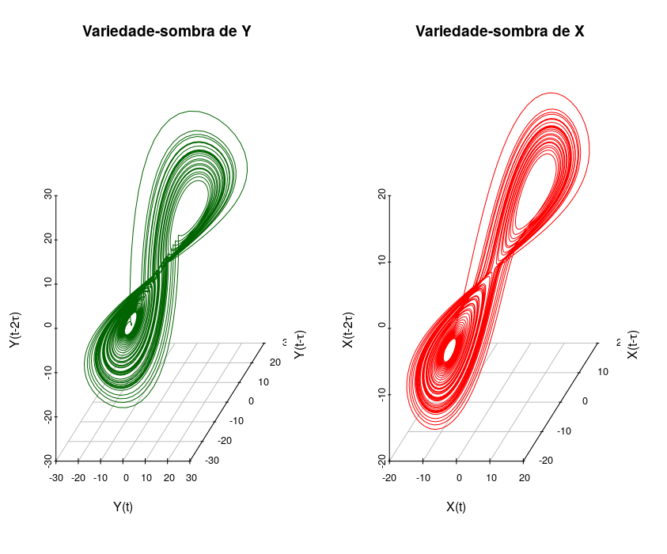
```
---
### Convergent Cross Mapping
  
--
* Com os atratores reconstruídos $M_X$ e $M_Y$, aplicamos a ideia do **Simplex**

* Seguir pontos vizinhos, $Y_i$, e com o futuro deles dar uma estimativa, $\hat{X}$, para o futuro do ponto, $X_c$, que se quer predizer

* Só que tudo isso é feito com a ideia de tentar predizer uma série, $Y(t)$, na outra, $X(t)$, por isso do nome **Cross Mapping**
---
### Convergent Cross Mapping
  
--
Numa figura temos o seguinte:
```{r echo=FALSE, out.height=475, out.width=700, fig.align='center'}
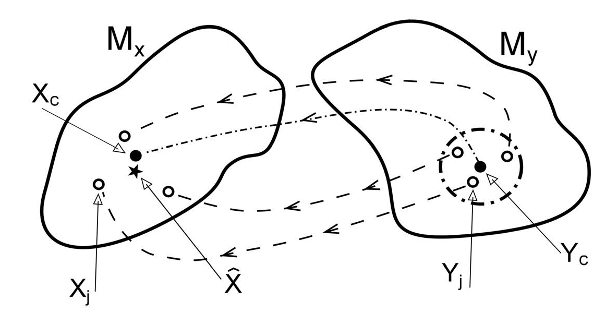
```
---
### Convergent Cross Mapping
  
--
Numa fórmula temos:
$$\hat{X}(t_i)|M_Y = \sum^{E+1}_{i=1}w_iX_i(t_i)$$
--
  
Onde os pontos $X_i(t_i)$ são determinados pelos pontos vizinhos ao centro preditor, através do indíces temporais deles
---
### Convergent Cross Mapping
  
--
Olhando lado a lado:
.pull-left[
$$\hat{X}(t_i)|M_Y = \sum^{E+1}_{i=1}w_iX_i(t_i)$$

Novamente, os pontos $X_i$ são encontrados em $M_X$ através dos indíces temporais dos pontos $Y_i$ em $M_y$
]

.pull-right[
```{r echo=FALSE, out.height=400, out.width=600, fig.align='center'}

```
]
---
### Convergent Cross Mapping
  
--
Como no **Simplex** queremos saber se essa predição é razoável e novamente tiramos a correlação entre predito e observado, só que dessa vez a predição é feita de modo cruzado:

$$
\begin{equation*}
\rho_{CCM} = \rho_{X(t),\hat{X}(t)|M_Y} = \frac{\mathrm{cov}(X(t),\hat{X}(t)|M_Y)}{\sigma_{X(t)}\sigma_{\hat{X}(t)|M_Y}}(L)
\label{rhoCCM}
\end{equation*}
$$
Porém aqui diferentemente do **Simplex** temos fazemos as predições de forma crescente, ou seja, vamos adicionando pontos que usamos de um atrator para predizer pontos do outro, chamamos a quantidade de pontos de **biblioteca**, $L$, ou seja, quanto de informação de um atrator usamos no outro
---
### Convergent Cross Mapping
  
--
Simplificando a notação temos:

$$
\begin{equation*}
\rho_{CCM} = \rho_{X,\hat{X}} = \frac{\mathrm{cov}(X,\hat{X})}{\sigma_{X}\sigma_{\hat{X}}}(L)
\label{rhoCCMsimple}
\end{equation*}
$$
Se conforme aumentarmos a **biblioteca**, $L$, essa correlação **convergir** para um valor, e que seja acima da correlação simples entre as séries, atingimos o critério de **Causalidade**
---
### Convergent Cross Mapping

--
Resumindo o algoritmo:

1. Selecionar a dimensão de **embedding** E , para a reconstrução de cada
atrator.

2. Com as **variedades-sombras**, $M_S$ , realizar a estimativa, $\hat{X}$ , de pontos
de um atrator se utilizando do pontos do outro atrator, nosso casos predizer $M_X$ com $M_Y$

3. Calcular a correlação entre o estimado e o observado, $\rho_{X,\hat{X}}$, ou o **mapeamento**

4. Se a correlação **convergir** para um valor acima da correlação simples entre as séries, atingimos o critério de **causalidade**

---
### Convergent Cross Mapping

--
<small>
.pull-left[
Resumindo o algoritmo:

1. **embedding** E , para a reconstrução de cada atrator.

2. Com as **variedades-sombras**, $M_S$ , realizar a estimativa, predizer $M_X$ com $M_Y$

3. correlação entre $M_Y$ e $M_X$, $\rho_{ccm}$, ou o **mapeamento**

4. **convergir** para um valor, atingimos o critério de **causalidade**
]

.pull-right[
```{r echo=FALSE, out.height=400, out.width=600, fig.align='center'}
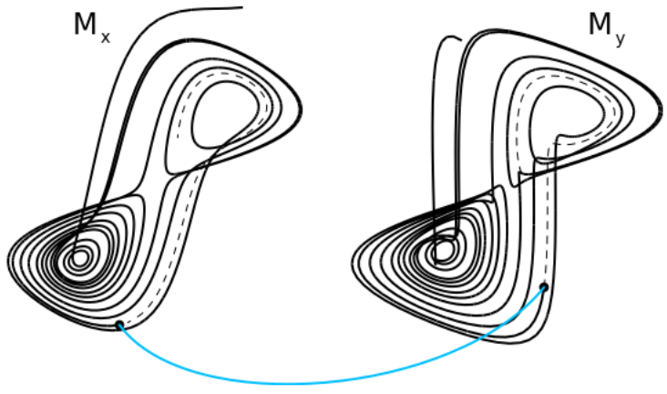
```
]
---
### Direção de Causalidade

--
* O critério de **causalidade** é a **convergência** da correlação $\rho_{ccm}$

* Se a variedade-sombra $M_Y$ de $Y$ pode ser **mapeada** na
variedade-sombra de $X$ , $M_X$ , então dizemos que há **causalidade** entre $X$ e
$Y$

* Dizemos ainda que a causa é então o $X$ e o efeito o $Y$, no sentido
contrário do **mapeamento**, pois o efeito guarda informações de
sua causa.

---
### CCM na prática

Geramos duas séries simples, como abaixo:
.pull-left[
```{r echo=TRUE}
## Two vectors to store data
X <- c()
Y <- c()
## Initial values
X[1] <- 0.1
Y[1] <- 0.3
X[2] <- 0.3
Y[2] <- 3.78*Y[1] - 3.78*Y[1]^2
## Iterate the dynamics 150 time steps
for(i in 3:150){
  X[i] <- 3.77*X[i-1] - 3.77*X[i-1]^2 - 0.9*Y[i-1]*X[i-1] - 0.5*X[i-2] #<<
  Y[i] <- 3.82*Y[i-1] - 3.82*Y[i-1]^2 #<<
}
XY<-data.frame(X=X,Y=Y)
```
]
--
.pull-right[
```{r echo=FALSE, out.height=400, out.width=900, fig.align='center'}
par(mfrow = c(2,1))
plot(Y, xlab = "",type = "l", col = "red", ylab = "Y")
plot(X, type = "l", col = "blue", ylab = "X", xlab = "time")

```
]
  
---
### CCM na prática

.pull-left[
**Simplex** para o $X$
```{r echo=TRUE}
simplex_X<-simplex(X,silent=T)
E_star_X<-which.max(simplex_X$rho)
print(paste('E*(X) =',E_star_X))
```
]

.pull-right[
```{r echo=TRUE, out.height=400, out.width=900, fig.align='center'}
par(mfrow = c(1,1))
plot(as.numeric(rho) ~ E, data = simplex_X, type='b', ylab = "Forecast Skill (rho)",
     xlab="Embedding Dimension (E)")
```
]
---
### CCM na prática

.pull-left[
**Simplex** para o $Y$
```{r echo=TRUE}
simplex_Y<-simplex(Y,silent=T)
E_star_Y<-which.max(simplex_Y$rho)
print(paste('E*(Y) =',E_star_Y))
```
]

.pull-right[
```{r echo=TRUE, out.height=400, out.width=900, fig.align='center'}
par(mfrow = c(1,1))
plot(as.numeric(rho) ~ E, data = simplex_Y, type='b', ylab = "Forecast Skill (rho)",
     xlab="Embedding Dimension (E)")
```
]
---
### CCM na prática

--

.pull-left[
```{r echo=TRUE}
# cross map from X to Y
X_xmap_Y<- ccm(XY, 
               E = E_star_X, #<<
               lib_column = "X", #<<
               target_column = "Y", #<<
               lib_sizes = seq(10, 150, by = 5), 
               # num_samples = 100, 
               random_libs = TRUE,
               replace = TRUE)
# cross map from Y to X
Y_xmap_X<- ccm(XY, 
               E = E_star_Y, #<<
               lib_column = "Y", #<<
               target_column = "X", #<<
               lib_sizes = seq(10, 150, by = 5), 
               # num_samples = 100, 
               random_libs = TRUE,
               replace = TRUE)
```
]

.pull-right[
```{r echo=TRUE, out.height=380, out.width=700, fig.align='center'}
# plot graphs
plot(X_xmap_Y$`X:Y` ~ X_xmap_Y$LibSize, lwd = 3,type = "l", col = "red",xlab = "Library Size (L)", ylab = "Cross Map Skill", ylim = c(0,1))
lines(Y_xmap_X$`Y:X` ~ Y_xmap_X$LibSize, col = "blue", lwd = 3, type = "l")
legend(x = "topleft", legend = c("X_xmap_Y", "Y_xmap_X"), col = c("red", "blue"),cex=1.1,lwd=3, inset = 0.02)
```
]
---
### CCM na prática

--
<small>
.pull-left[
* Criamos séries temporais, $X$ e $Y$, com o **Simplex** descobrimos a dimensão de **embedding** de cada uma das śeries

* Com essa dimensão $E$ reconstruímos seus atratores, e como esses atratores, $M_X$ e $M_X$, fizemos o **mapeamento** cruzado

* Para o mapeamento que **convergiu** para um valor pudemos determinar a causa da série, no caso $Y$ causa $X$, e o mapeamento que **convergiu** foi o $X$ em $Y$
]

.pull-right[
```{r echo=FALSE, out.height=400, out.width=800, fig.align='center'}
# plot graphs
plot(X_xmap_Y$`X:Y` ~ X_xmap_Y$LibSize, lwd = 3,type = "l", col = "red",xlab = "Library Size (L)", ylab = "Cross Map Skill", ylim = c(0,1))
lines(Y_xmap_X$`Y:X` ~ Y_xmap_X$LibSize, col = "blue", lwd = 3, type = "l")
legend(x = "topleft", legend = c("X_xmap_Y", "Y_xmap_X"), col = c("red", "blue"),cex=1.1,lwd=3, inset = 0.02)
```
]
---
# Obrigado!
  
### Referências:
  
* Materiais e slides: [rafalopespx.github.io/WorkshopEDM/](http://rafalopespx.github.io/WorkshopEDM/)

<!-- * Vídeos do [YouTube](http://www.youtube.com/watch?v=fevurdpiRYg&list=PL-SSmlAMhY3bnogGTe2tf7hpWpl508pZZ) sobre o Teorema de Takens. -->
  
* Canal do [Slack](https://app.slack.com/client/T01BJETR8S3/C01CXH8H9KM) para discussão, dúvidas, etc.

* Tutorial Hands-on Takens Theorem [Day 1](https://rafalopespx.github.io/WorkshopEDM/Hands-on_Takens.html)

* Tutorial Simplex projection made it simple [Day 2](https://rafalopespx.github.io/WorkshopEDM/simplex.html)

* Tutorial Convergent Cross Mapping [Day 3](https://rafalopespx.github.io/WorkshopEDM/ccm.html)

---
### Extra

--
Borboletas da tribo *Ithomiini*

.pull-left[
```{r echo=FALSE, out.height=300, out.width=500, fig.align='center', fig.cap="Macroanel tigrado, A – H.ninonia, B – M.polymnia, C – M.lysimnia, D – H.euclea"}
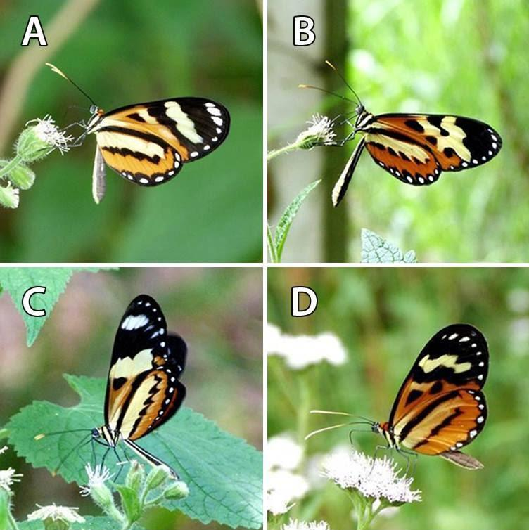
```
]

.pull-right[
```{r echo=FALSE, out.height=300, out.width=500, fig.align='center', fig.cap="Macroanel transparente, E – H.lavinia, F – I.agnosia, G – E.eupompe, H – M.c.salonina"}
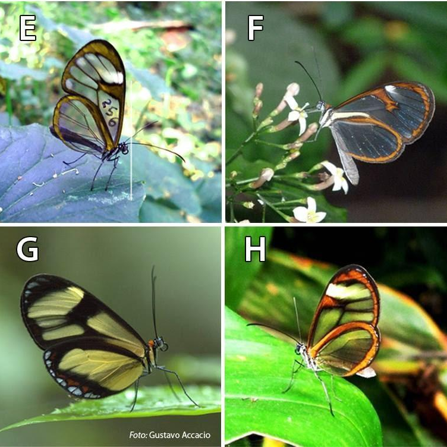
```
]
---
### Extra

```{r echo=FALSE, out.height=500, out.width=900, fig.align='center'}
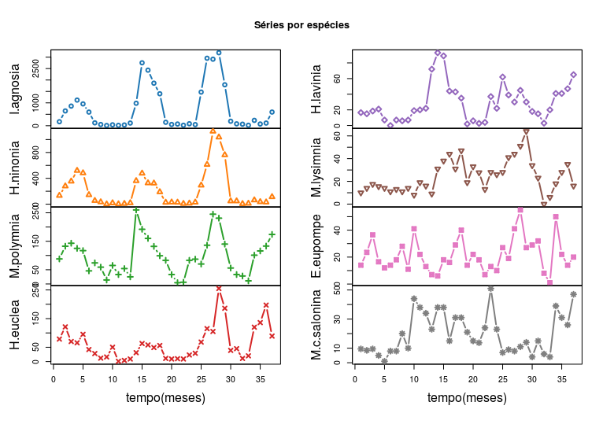
```
---
### Extra

```{r echo=FALSE, out.height=500, out.width=800, fig.align='center'}
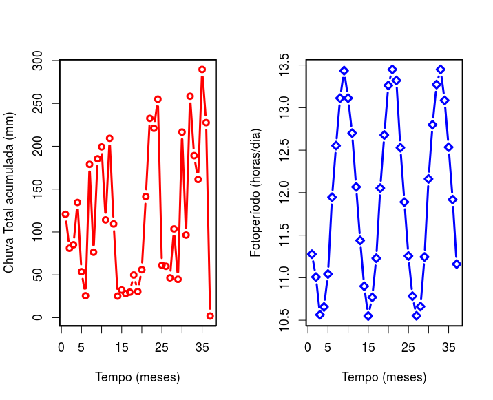
```
---
### Extra

--
Seleção de **embedding** para cada uma das séries de borboletas:
.pull-left[
```{r echo=FALSE, out.height=400, out.width=600, fig.align='center'}
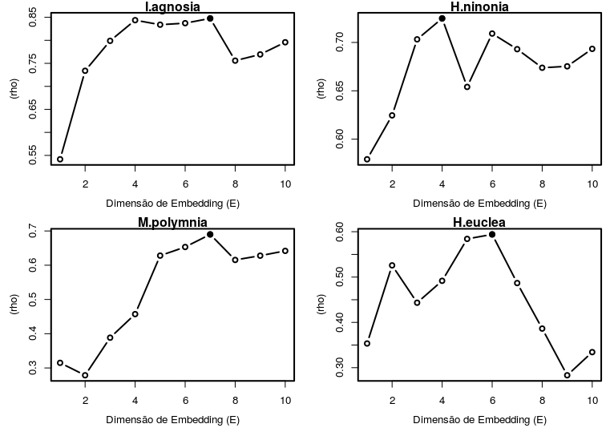
```
]

.pull-right[
```{r echo=FALSE, out.height=400, out.width=600, fig.align='center'}
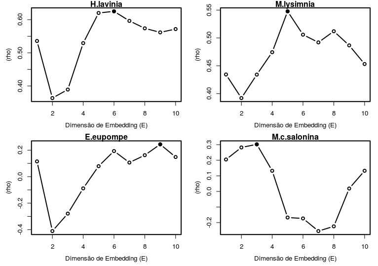
```
]
---
### Extra

```{r echo=FALSE, out.height=500, out.width=900, fig.align='center'}
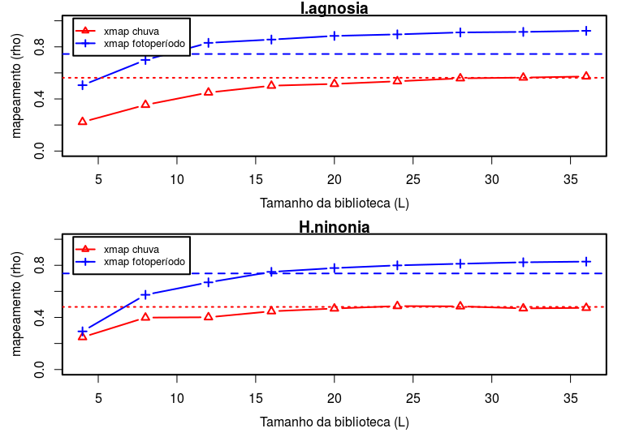
```
---
### Extra

```{r echo=FALSE, out.height=500, out.width=900, fig.align='center'}
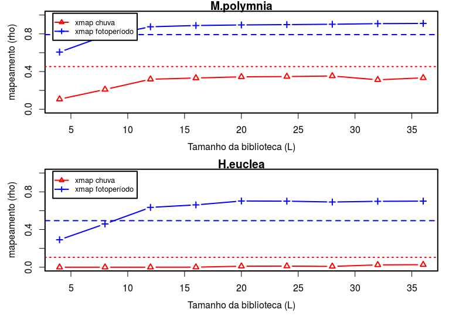
```
---
### Extra

```{r echo=FALSE, out.height=500, out.width=900, fig.align='center'}
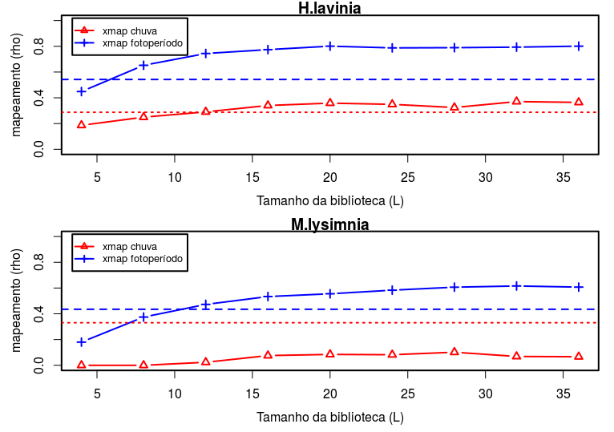
```
---
### Extra

```{r echo=FALSE, out.height=500, out.width=900, fig.align='center'}
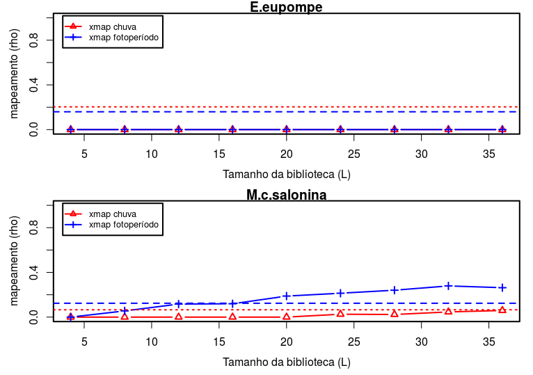
```

---
### Extra

* De onde concluímos que o **Fotoperíodo** é um fator causador da dinâmica da maioria das espécies de borboletas da tribo *Ithomiini*

* Podemos nos perguntar também se a há relação de causa entre essas borboletas, ou seja, se uma espécie afeta a dinâmica da outra também
  
---
### Extra

<small>
.pull-left[
E há sim, fazendo todo o algoritmo do **Empirical Dynamic Modelling**, chegamos no seguinte, para cada espécie temos que realizar 7 **CCM**, contra todas as outra espécies da tribo, temos então que fazer 56 **CCM**

**CCM** para a espécie *M. Polyminia* ao lado
]

.pull-right[
```{r echo=FALSE, out.height=500, out.width=800, fig.align='center'}
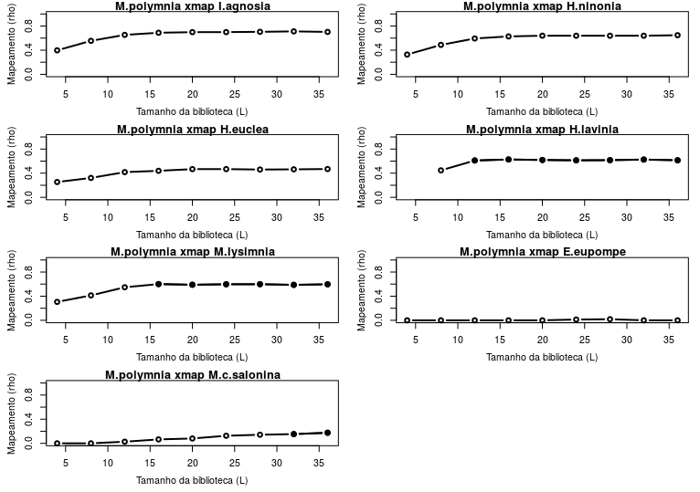
```
]
---
### Extra

Se colocarmos todas essa relações de causa numa rede temos o seguinte:

```{r echo=FALSE, out.height=500, out.width=800, fig.align='center'}
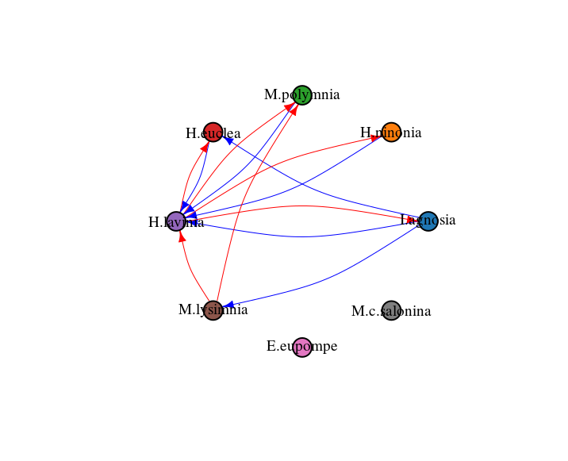
```